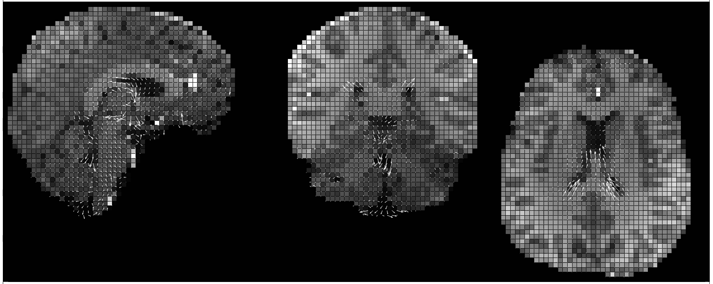

# Brain Pulsation Imaging 
This repository contains example code that can be used to replicate parts of the simulations reported in the following paper:
P.E.Goa, S.Blömer, R. Stirnberg and T. Stöcker. Brain Pulsation Imaging using non-balanced Steady-state Free Precession with 3D-EPI readout, Magn Reson Med 2025,
https://doi.org/10.1002/mrm.70156

How to use the code:
1. Download the two matlab-files.
2. Modify the settings in the EPG_brainpulsation_script.m to your needs.
3. Run the script.

Example Brain Pulsation Imaging Result (from Goa et al. Magn Reson Med 2025  https://doi.org/10.1002/mrm.70156):

